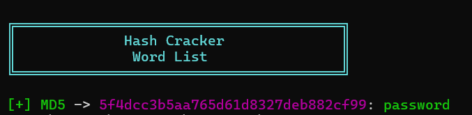
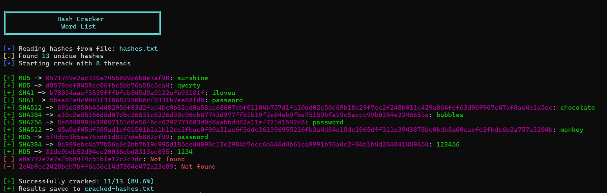

# Crypt Hash Cracker Documentation

## Table of Contents
1. [Project Overview](#project-overview)
2. [Installation](#installation)
3. [Usage](#usage)
4. [Hash Processing](#hash-processing)
5. [Examples](#examples)

## Project Overview📝
The Crypt Hash Cracker is a command-line tool designed to crack various types of cryptographic hashes using a dictionary-based approach. The project consists of two main components: a hash generation tool (`hash_create.py`) for creating test data, and the main cracking tool (`hash.py`). It supports multiple hash types including MD5, SHA1, SHA256, SHA384, and SHA512, making it versatile for testing and educational purposes.

## Installation⚙️
To install and run the Crypt Hash Cracker locally, follow these steps:

1. Clone the project repository:
```bash
git clone https://github.com/RobCyberLab/Crypt-Hash-Cracker.git
```

2. Navigate to the project directory:
```bash
cd crypt-hash-cracker
```

3. Install required Python packages:
```bash
pip install requests urllib3 tqdm
```

4. Download a wordlist (e.g., rockyou.txt) for testing:
```bash
wget https://github.com/brannondorsey/naive-hashcat/releases/download/data/rockyou.txt
```

## Usage📖
The project consists of two main scripts:

### Hash Creation (hash_create.py)
1. Place your wordlist file (e.g., rockyou.txt) in the project directory
2. Run the hash creation script:
```bash
python3 hash_create.py
```
- The script will generate `all_hashes.txt` containing hashes for each password in various formats

### Hash Cracking (hash.py)
The main cracking tool supports several modes of operation:

1. Crack a single hash:
```bash
python3 hash.py -s <hash>
```

2. Crack multiple hashes from a file:
```bash
python3 hash.py -f <hashfile>
```

3. Additional options:
   - `-t, --threads`: Number of threads (default: 4)
   - `-v, --verbose`: Enable verbose output

## Hash Processing🔐
The project implements several key features for hash processing:

### Supported Hash Types
```python
hash_types = {
    32: "MD5",
    40: "SHA1",
    64: "SHA256",
    96: "SHA384",
    128: "SHA512"
}
```

### Hash Generation Process
```python
def generate_hash(password, hash_type='md5'):
    encoded = password.encode('utf-8')
    if hash_type == 'md5':
        return hashlib.md5(encoded).hexdigest()
    elif hash_type == 'sha1':
        return hashlib.sha1(encoded).hexdigest()
    # ... additional hash types
```

### Rate Limiting
The tool implements rate limiting to prevent resource exhaustion:
```python
class RateLimiter:
    def __init__(self, calls: int, period: float):
        self.calls = calls
        self.period = period
        self.timestamps = []
```

## Examples📌

### Example 1: Creating Hash Database
```bash
python3 hash_create.py
```
Output:
```
Hashing Progress: 100%|██████████| 14344384/14344384 [00:45<00:00, 316543.62it/s]
Created all_hashes.txt
```

### Example 2: Cracking Single Hash
```bash
python3 hash.py -s 5f4dcc3b5aa765d61d8327deb882cf99
```
Output:
```
[+] MD5 -> 5f4dcc3b5aa765d61d8327deb882cf99: password
```
<p align="center">
  
  <br>
  <em>Single Hash: 5f4dcc3b5aa765d61d8327deb882cf99 </em>
</p>


### Example 3: Cracking Multiple Hashes
```bash
python3 hash.py -f hashes.txt -t 8
```

Input hashes.txt contains:
```
5f4dcc3b5aa765d61d8327deb882cf99
81dc9bdb52d04dc20036dbd8313ed055
d8578edf8458ce06fbc5bb76a58c5ca4
5baa61e4c9b93f3f0682250b6cf8331b7ee68fd8
5e884898da28047151d0e56f8dc6292773603d0d6aabbdd62a11ef721d1542d8
65a0ef45df509ad1cf01501b2a1b12cc2fbac0f00a31ae6f3ddc361396955216fb3a4d84e18dc1065dff311e3943878bc0bdb8a60caefd2fbdc6b2a757a3204b
b78034aacf3559fffbfcb545d9a9122efb93181f
0571749e2ac330a7455809c6b0e7af90
691d5950b454482956f83d2fae4bc0b32cd0a53ac68607ebf01104b757d1fa10dd02c50d69b18c29f7ec2f248b011c429a864fef63d069967c47af8ae4e1a5ee
a8a772e7a7afbb84f4c51bfe12c2c7dc
2e4b9cc2428beb7bff6a56c14d7304e472a23e890e91ef0a6b0b0380e8
0a989ebc4a77b56a6e2bb7b19d995d185ce44090c13e2984b7ecc6d446d4b61ea9991b76a4c2f04b1b4d244841449454
e10c2e85166d8d07d6c26831c8226d30c96cb87742d977ff81b19f2e84eb9fbe75159bfa19c5accc99b0354e2346651e
```

Output:
```
[*] Reading hashes from file: hashes.txt
[!] Found 13 unique hashes
[*] Starting crack with 8 threads

[+] Successfully cracked: 11/13 (84.6%)
[+] Results saved to cracked-hashes.txt
```

<p align="center">
  
  <br>
  <em>Multiple Hashes in hashes.txt</em>
</p>

Cracked Hashes are written down in cracked-hashes.txt file.

```
sunshine:0571749e2ac330a7455809c6b0e7af90:MD5
qwerty:d8578edf8458ce06fbc5bb76a58c5ca4:MD5
iloveu:b78034aacf3559fffbfcb545d9a9122efb93181f:SHA1
password:5baa61e4c9b93f3f0682250b6cf8331b7ee68fd8:SHA1
chocolate:691d5950b454482956f83d2fae4bc0b32cd0a53ac68607ebf01104b757d1fa10dd02c50d69b18c29f7ec2f248b011c429a864fef63d069967c47af8ae4e1a5ee:SHA512
bubbles:e10c2e85166d8d07d6c26831c8226d30c96cb87742d977ff81b19f2e84eb9fbe75159bfa19c5accc99b0354e2346651e:SHA384
password:5e884898da28047151d0e56f8dc6292773603d0d6aabbdd62a11ef721d1542d8:SHA256
monkey:65a0ef45df509ad1cf01501b2a1b12cc2fbac0f00a31ae6f3ddc361396955216fb3a4d84e18dc1065dff311e3943878bc0bdb8a60caefd2fbdc6b2a757a3204b:SHA512
password:5f4dcc3b5aa765d61d8327deb882cf99:MD5
123456:0a989ebc4a77b56a6e2bb7b19d995d185ce44090c13e2984b7ecc6d446d4b61ea9991b76a4c2f04b1b4d244841449454:SHA384
1234:81dc9bdb52d04dc20036dbd8313ed055:MD5
```

Note: The tool includes several features to enhance functionality:
- Multi-threading support for faster processing
- Color-coded output for better readability
- Progress tracking for bulk operations
- Automatic hash type detection
- Local hash database support
- Result saving functionality

These features make the tool efficient for both educational purposes and practical hash cracking exercises while maintaining a focus on performance and usability.
